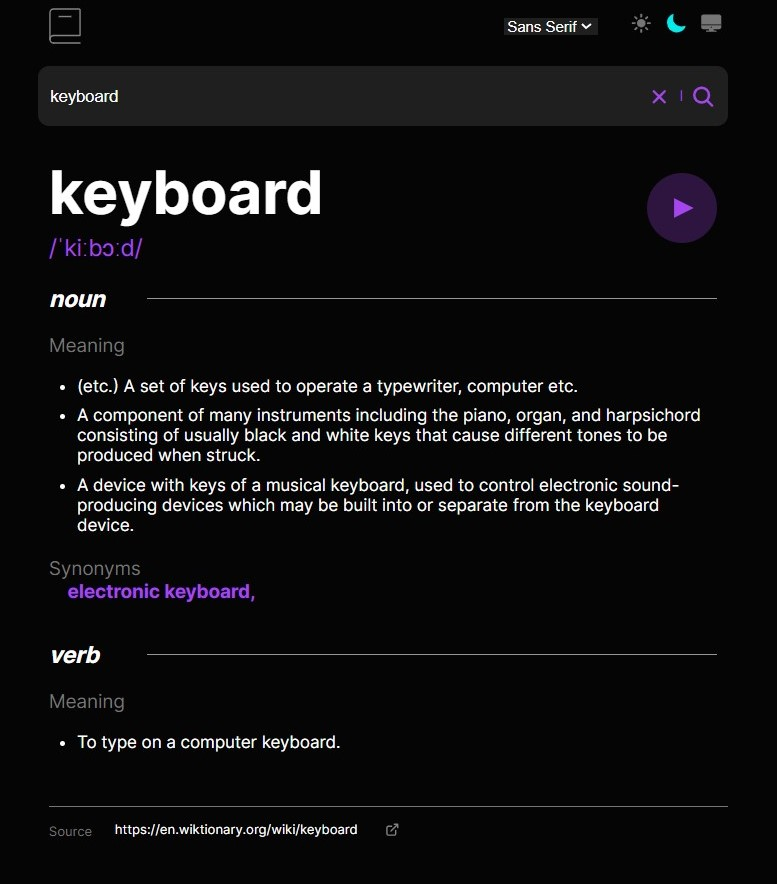

# Frontend Mentor - Dictionary web app solution

This is a solution to the [Dictionary web app challenge on Frontend Mentor](https://www.frontendmentor.io/challenges/dictionary-web-app-h5wwnyuKFL). Frontend Mentor challenges help you improve your coding skills by building realistic projects. 

## Table of contents

- [Overview](#overview)
  - [The challenge](#the-challenge)
  - [Screenshot](#screenshot)
  - [Links](#links)
- [My process](#my-process)
  - [Built with](#built-with)
  - [What I am proud of](#what-i-am-proud-of)
  - [Continued development](#continued-development)
  - [Useful resources](#useful-resources)
- [Author](#author)
- [Acknowledgments](#acknowledgments)


## Overview

### The challenge

Users should be able to:

- Search for words using the input field
- See the Free Dictionary API's response for the searched word
- See a form validation message when trying to submit a blank form
- Play the audio file for a word when it's available
- Switch between serif, sans serif, and monospace fonts
- Switch between light and dark themes
- View the optimal layout for the interface depending on their device's screen size
- See hover and focus states for all interactive elements on the page
- **Bonus**: Have the correct color scheme chosen for them based on their computer preferences. _Hint_: Research `prefers-color-scheme` in CSS.

### Screenshot




### Links

- Solution URL:  [Github repository](https://github.com/memominguez/dictionary-app)
- Live Site URL:  [Netlify](https://english-lang-dictionary.netlify.app)


## My process

### Built with

- Semantic HTML5 markup
- CSS custom properties
- Flexbox
- Mobile-first workflow
- [React](https://reactjs.org/) - JS library


### What I am proud of

- Nested mapping was specially challenging, showing the multiple options provided from the API.
- Map indexes were specified for mapping the results Object at the several levels, as coded in the DisplayResults.jsx component (code too long for showing it here): 
  - "index" for the first level
  - "mIndex" for the meanings (second level)
  - "dIndex" for the meaning definitions (third level)
  - "sIndex" for listing the synonyms (also at third level)

- In the case of phonetics options, only those links including the "-us" string were selected (american accent).

- CSS functionality used for selecting the font family


```html
  <div className={`container ${selectedFont}`}>
    ...
  </div>
```
```css
/* *** Select Font *** */
.container:is(.sanserif) {
  font-family: "Inter", sans-serif;
}
.container:is(.serif) {
  font-family: "Lora", serif;
}
.container:is(.mono) {
  font-family: "Inconsolata", monospace;
}
```

- The theme selection considers the three options: light, dark, and system, as coded in the ThemeSwitch.jsx component (code too long for showing it here)
- Extras
  - A button for selecting the "system" color theme
  - A clear button X for clearing the input field
  - The search function can be triggered either by clicking the Search button or by pressing Enter


### Continued development

Continue improving my coding skills by developing challenging applications, like this one.

### Useful resources

- [Video tutorial](https://www.youtube.com/watch?v=NMTq5HIxMa8) - This helped me by providing aa sample code for switching color theme among light, dark, and system modes.
- Significant help provided by ChatGPT, about the nested mapping subject.


## Author


- Website - [Guillermo Dominguez](https://gdominguez2024.vercel.app/)
- Frontend Mentor - [@memominguez](https://www.frontendmentor.io/profile/memominguez)

## Acknowledgments


Thanks to all those who share their knowledge, free of charge, through video tutorials in the youtube platform.

